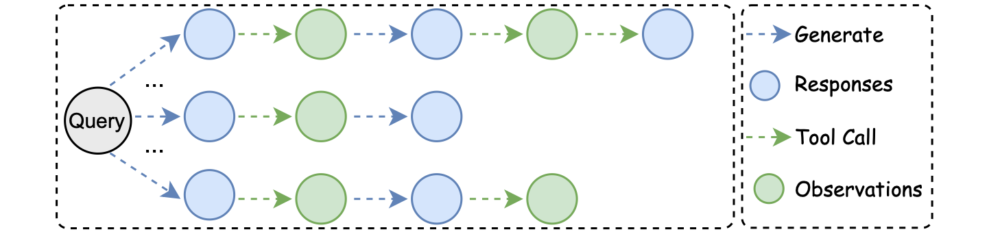
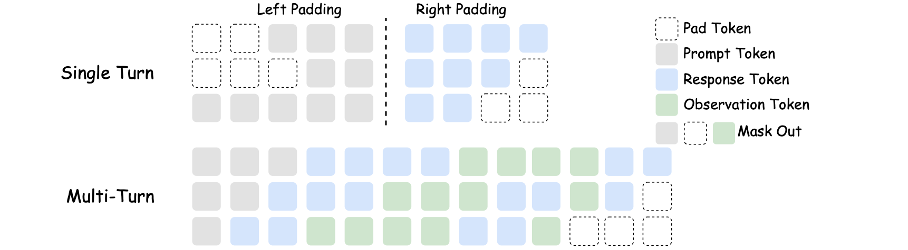
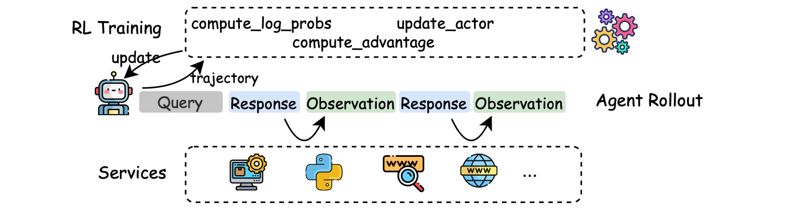

# AgentFly: Reinforcement Larning for LLM Agents with Extensive Environments

This library is an extandable framework for building LLM agents with reinforcement learning. It provides a flexible and powerful system for creating agent that interact with tools, learn from rewards in multi-turn manner and complete tasks automatically.

## Installation
```bash
git submodule init
git submodule update
pip install -r agents/requirements.txt
pip install -r verl/requirements.txt
# We need redis-server for caching search results
conda install conda-forge::redis-server==7.4.0
```

## Run Example Training
Suppose you are in a compute node (with 8 gpus).

Run RL training of code
```python
cd verl
bash examples/run_agents/run_code_agent.sh
```


## Agent Reinforcement Learning
### 1. Multi-Chain Agent Rollout
To support algorithms like GRPO, Reinforce++, we design multi-chain inference, enabling agents to solve one task with multiple paths at the same time.



### 2. Multi-Turn RL Training
Unlike traditional RL training, we building RL computation and updating in multi-turn manner by applying masking.


### 3. Decoupled Design
We design a three-layer design, where RL Training, Agent Rollout, and Services are decoupled.


## Easily Extendable Environments
By simply applying `@tool` decorator to functions, we make these functions usable by agents. 


## Training Curves
