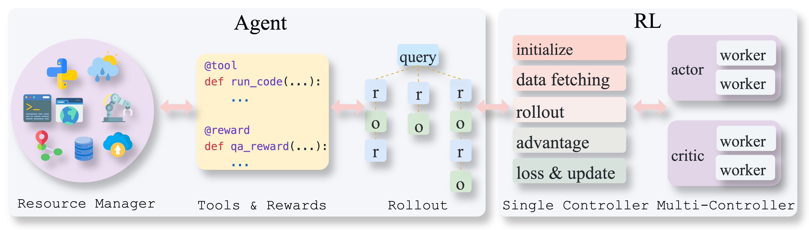
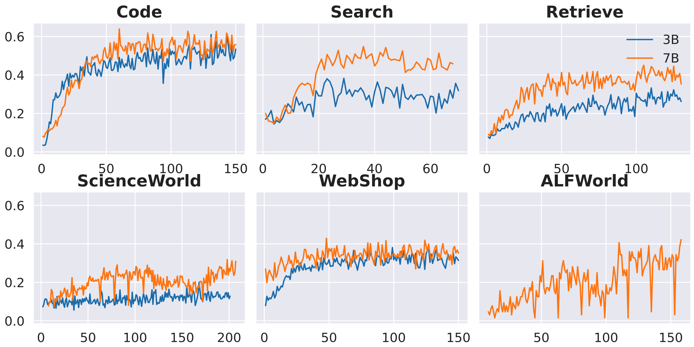

# 🪽AgentFly: Training scalable LLM agents with RL (multi-turn, async tools/rewards, multimodal)


<p align="center">
<a href="https://arxiv.org/pdf/2507.14897" target="_blank"></a>
<a href="https://agentfly.readthedocs.io/" target="_blank"></a>
<a href="https://wandb.ai/AgentRL/Open" target="_blank"></a>
<a href="https://huggingface.co/collections/Agent-One/agentfly-6882061c6cf08537cb66c12b" target="_blank"></a>
<a href="https://github.com/Agent-One-Lab/AgentFly" target="_blank"></a>
</p>
<p align="center">


<br>


<br>


</p>

AgentFly is an extensible framework for building LLM agents with reinforcement learning. It supports multi-turn training by adapting traditional RL methods with token-level masking. It features a decorator-based interface for defining tools and reward functions, enabling seamless extension and ease of use. To support high-throughput training, it implemented asynchronous execution of tool calls and reward computations, and design a centralized resource management system for scalable environment coordination. A suite of prebuilt tools and environments are provided.


## News

**08/2025 Multi-Modal (Vision) Agent Training Support** - Thanks to the powerful template system, AgentFly now supports training vision-language agents! 🎉 Train agents that can see and understand visual content, including GUI automation and image-based QA. See our [predefined training examples](docs/examples/predefined_training_examples.md) for ready-to-use scripts.

---

**08/2025 Chat Template System** - A flexible framework for creating conversation templates with multi-model support, vision capabilities, and tool integration. [Learn more →](docs/chat_template/)

## Installation
**Option 1**: One-line Installation:
```
bash install.sh # Assume conda with python3.10.x
```
**Option 2**: Customized Installation

Please refer to [installation.md](docs/start/installation.md) for custmoized installation.

## Quick Start
```python
# Really small example to build an agent and run
from agentfly.agents import HFAgent
from agentfly.tools import calculate
messages = [{"role": "user", "content": "What is the result of 1 + 1?"}]
agent = HFAgent(
    model_name_or_path="Qwen/Qwen2.5-3B-Instruct",
    tools=[calculate],
    template="qwen2.5",
    backend="async_vllm",
)
await agent.run(
    messages=messages,
    max_turns=3,
    num_chains=1
)

trajectories = agent.trajectories
print(trajectories)
```

## Features
### 1. Multi-Chain Agent Rollout and Multi-Turn Training
To support algorithms like GRPO, Reinforce++, we design multi-chain inference, enabling agents to solve one task with multiple paths at the same time. We build RL computation and update LLMs in multi-turn manner by applying token masks. The training is based on [verl](https://github.com/volcengine/verl).


### 2. Simple Tool and Reward Integration
Define tools and rewards, which can be used directly by agents.
```python
@tool(name=...)
def customized_tool(...):
    ...

def custmozed_reward(...):
    ...

agent = ReactAgent(
    model_name,
    tools=[customized_tool],
    reward=customized_reward
)
```

### 3. Easy Development
Decoupled agent and training module. Simply customize your own agent, which can directly be applied to training.

## Training Curves
Reward curves on Qwen2.5-Instruct 3B and 7B models.



## Training
### Run Example Training
Suppose you are in a compute node (with 8 gpus). We have prepared some training scripts for different tasks and tools in `verl/examples/run_agents/`. The script will try to download our prepared datasets and run training.

Run RL training of code_interpreter:
```python
cd verl
bash examples/run_agents/run_code_agent.sh
```
### Customized Training
To customize your own training, you need to prepare: 1. Datasets. 2. Define or use existing tools. 3. Define or use existing rewards. 3. Define your own agents or use an existing type of agent.

#### 1. Data Format:
Data should be a json file, which contain a list of dicts with the following keys:
```json
[
    {
        "question": ...
        "optional_field1": ...
        "optional_field2": ...
        ...
    }
]
```
During training, `question` will be used to format the input messages, while other fields can be used in reward function. An example message that are put into the agent looks like this:
```json
{
    "messages": [
        {"role": "user", "content": [{"type": "text", "text": question}]}
    ]
    "optional_field1": ...
    "optional_field2": ...
    ...
}
```
#### 2. Tools & Rewards
You can use any existing tool, which is in [documentation](https://agentfly.readthedocs.io/), or define a tool by decorating it with `@tool`. The output should eighther be a string, or a dictionary containing `observation` as a key.
```python
@reward(name="customized_tool")
def customized_tool(arg1, arg2):
    # tool logic here
```

Define your reward function or use an existing one. The reward function can accept `prediction` and `trajectory` as the argument, which is the agent's final response and the whole trajectory. Other fields will also be given if you defined them in dataset. To use them, simply put these fields as arguments in reward function.

```python
@reward(name="customized_reward")
def customized_reward(prediction, trajectory, optional_field1, optional_field2):
    # calculate reward
    ...
```

For stateful tools and rewards that hold environment instances, please refer to [documentation](https://agentfly.readthedocs.io/).

#### 3. Agents
You can use existing code agent, react agent, or customize an agent. To customize an agent, the agent class must inherit `BaseAgent`, which handles tool calling, chain rollout. You can custom the `generate` and `parse` function. Refer to [documentation](https://agentfly.readthedocs.io/) for more details.

```python
class CustomizedAgent(BaseAgent):
    def __init__(self,
        **kwargs
    )
        super().__init__(**kwargs)

    async def generate_async(self, messages_list: List[List[Dict]], **args):
        return await self.llm_engine.generate_async(messages_list, **args)

    def parse(self, responses: List(str), tools):
        # parse responses into tool calls
        ...
```

## Demo
1. The following shows an example of WebShop agent.

2. What does the training look like. During training, the resource system will dynamically allocate environments.

3. Monitoring training on [WANDB](https://wandb.ai/). Items include number of turns for each step, numer of tool calls, allocated environments.

https://github.com/user-attachments/assets/b8f42534-8d40-48a0-a264-f378e479bb3a


## Contribute & Discussion
[WeChat|微信](assets/images/wechat.jpg)

[Discord](https://discord.gg/CchUj7Sp)


## Cite
If you used our code or find it helpful, please cite:
```
@misc{wang2025agentfly,
      title={AgentFly: Extensible and Scalable Reinforcement Learning for LM Agents}, 
      author={Renxi Wang and Rifo Ahmad Genadi and Bilal El Bouardi and Yongxin Wang and Fajri Koto and Zhengzhong Liu and Timothy Baldwin and Haonan Li},
      year={2025},
      eprint={2507.14897},
      archivePrefix={arXiv},
      primaryClass={cs.AI},
      url={https://arxiv.org/abs/2507.14897}, 
}
```